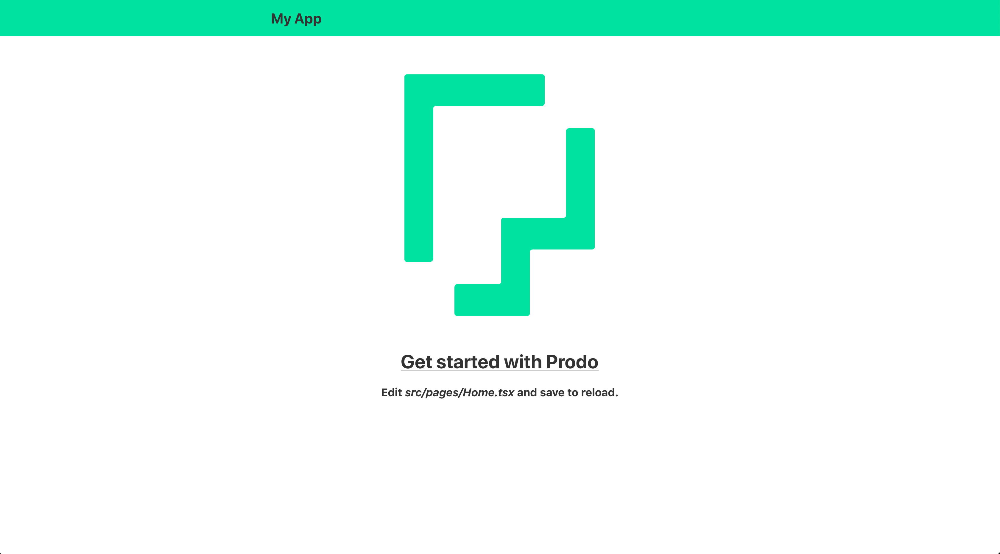
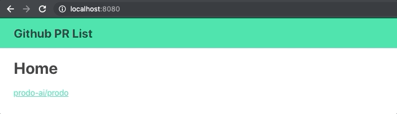
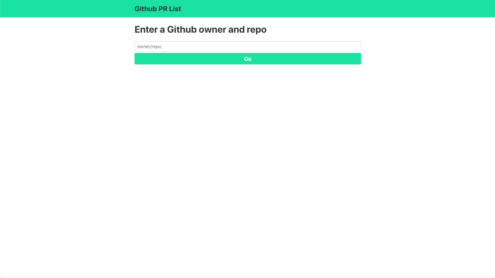
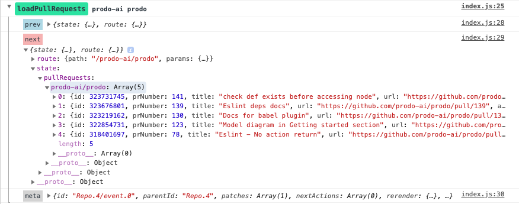
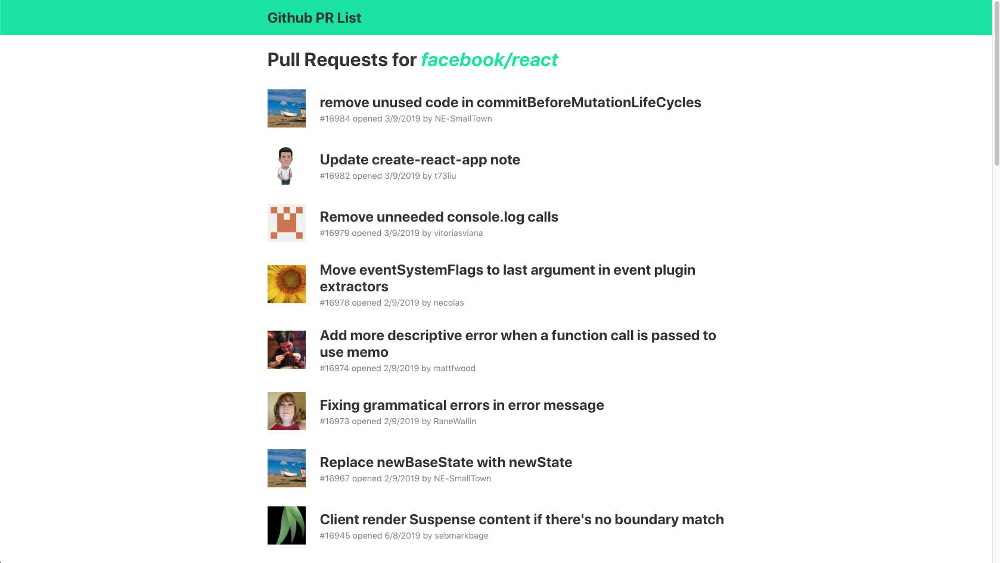

In this tutorial we will be building an app that lists [pull
requests](https://help.github.com/en/articles/about-pull-requests) on Github for
a repo. You can find the completed app and code in the following links.

- [Deployed app](https://prodo-github-prs.netlify.com/)
- [Github](https://github.com/prodo-ai/github-prs)

[](https://codesandbox.io/s/github-pr-list-noxhw?fontsize=14&module=%2Fsrc%2Fmodel.ts)

# Create Prodo App

The easiest way to get started with Prodo is with
[create-prodo-app](/introduction/create-prodo-app). In this tutorial we will use
[TypeScript](https://www.typescriptlang.org/) and
[Yarn](https://yarnpkg.com/lang/en/).

Run the following command to create a Prodo app in the `github-prs` directory.

```shell
yarn create prodo-app github-prs
```

This will create the directory structure.

```
github-prs/
├── README.md
├── package.json
├── public
│   ├── index.html
│   ├── favicon.ico
│   └── robots.txt
├── src
│   ├── App.tsx
│   ├── index.tsx
│   ├── model.ts
│   └── styles.css
│   ├── components
│   │   └── Header.tsx
│   ├── pages
│   │   ├── Home.tsx
│   │   └── NotFound.tsx
├── tests
│   └── App.test.tsx
├── tsconfig.json
├── webpack.config.js
```

Navigate to the app's directory and install the dependencies.

```shell
cd github-prs
yarn
```

After this completes, you can start the app by running

```shell
yarn start
```

Open up [localhost:8080](http://localhost:8080) and you should see this:



The app created with create-prodo-app (CPA) is fairly minimal, yet a good
starting point when creating simple or complex Prodo apps. It includes two
[Prodo plugins](/basics/plugins): logger and route, which we will look at in the
next section.

CPA uses [Webpack](https://webpack.js.org/) to bundle your app and is setup with
[hot module replacement
(HMR)](https://webpack.js.org/concepts/hot-module-replacement/). This means when
you make a change, your app will update without the page refreshing.

Let's change the header in `src/components/Header.tsx`.

```tsx
import * as React from "react";
import { Link } from "@prodo/route";

const Header = () => (
  <header>
    <div className="container">
      // highlight-next-line
      <Link to="/">Github PR List</Link>
    </div>
  </header>
);

export default Header;
```

The page should update automatically with the new text.

# Specifying the model

In a Prodo app your state is stored in a global store which is accessed by your
components and updated by your actions. The type of this state is defined in a
[model](/basics/model) in `src/model.ts`. Plugins can also be added to the model to extend the
functionality.

The model is created with `createModel` using the `State` type. Initially the
app has no state. We also add the [logger](/plugins/logger) and
[route](/plugins/routing) plugins. The logger plugin logs useful information to
the console. The route plugin gives us client side routing.

## Adding some state

In our app we want to store a list of pull requests per repo. We can do that with:

```ts
import { createModel } from "@prodo/core";
import loggerPlugin from "@prodo/logger";
import routePlugin from "@prodo/route";

// highlight-start
export interface PullRequest {
  id: number;
  prNumber: number;
  title: string;
  url: string;
  author: string;
  authorImage: string;
  createdAt: string;
}

export interface State {
  pullRequests: { [key: string]: PullRequest[] };
}
// highlight-end

export const model = createModel<State>()
  .with(loggerPlugin)
  .with(routePlugin);

export const { state, watch, dispatch } = model.ctx;
```

The list of pull requests will be keyed by a string that matches the
`owner/repo` format.

When creating the store in `src/index.tsx` we now need to initialize the
`pullRequests` in our state.

```ts
// ...

const history = createBrowserHistory();
const { Provider } = model.createStore({
  logger: true,
  route: {
    history,
  },
  // highlight-start
  initState: {
    pullRequests: {},
  },
  // highlight-end
});

// ...
```

# Routing

Our app will have two routes, one for searching and one for a repo. CPA includes
a pre-configured [route plugin](/plugins/routing) so all we need to do is define
the routes in `src/App.tsx`.

```tsx
import * as React from "react";
import { Switch, Route } from "@prodo/route";
import Header from "./components/Header";
import NotFound from "./pages/NotFound";
// highlight-start
import Home from "./pages/Home";
import Repo from "./pages/Repo";
// highlight-end

const App = () => (
  <div className="app">
    <Header />

    <div className="container">
      <Switch>
        // highlight-start
        <Route exact path="/" component={Home} />
        <Route path="/:owner/:repo" component={Repo} />
        // highlight-end
        <Route component={NotFound} />
      </Switch>
    </div>
  </div>
);

export default App;
```

Route parameters get passed to components as props. Create a _Repo_ page in
`src/pages/Repo.tsx` with the following contents:

```tsx
import * as React from "react";
import { Link } from "@prodo/route";

export interface Props {
  owner: string;
  repo: string;
}

const Repo: React.FC<Props> = ({ owner, repo }) => (
  <div className="repo">
    <h1>
      {owner}/{repo}
    </h1>
    <Link to="/">Home</Link>
  </div>
);

export default Repo;
```

and change `src/pages/Home.tsx` to:

```tsx
import * as React from "react";
import { Link } from "@prodo/route";

const Home = () => (
  <div className="home">
    <h1>Home</h1>
    <Link to="/prodo-ai/prodo">prodo-ai/prodo</Link>
  </div>
);

export default Home;
```

You should now be able to navigate between the home page and a repo page.



# Github API

The next step is to connect the [Github REST
API](https://developer.github.com/v3/). You could also you the [GraphQL
API](https://developer.github.com/v4/), however, that requires an authentication
token. The API route we are interested in is [list pull
requests](https://developer.github.com/v3/pulls/#list-pull-requests).

Create the file `src/api.ts` with the following contents:

```ts
import { PullRequest } from "./model";

export const getPullRequests = async (
  owner: string,
  repo: string,
): Promise<PullRequest[]> => {
  const data = await fetch(
    `https://api.github.com/repos/${owner}/${repo}/pulls`,
  ).then(res => res.json());

  if (data.message != null) {
    throw new Error(data.message);
  }

  const pullRequests: PullRequest[] = data.map((d: any) => ({
    id: d.id,
    prNumber: d.number,
    title: d.title,
    url: d.html_url,
    author: d.user.login,
    authorImage: d.user.avatar_url,
    createdAt: d.created_at,
  }));

  return pullRequests;
};
```

This function returns a Promise of a list of pull requests.

# Creating actions

We can create a [Prodo action](/basics/actions) to fetch the pull requests and
add them to our app's state. In a file called `src/actions.ts` place the following:

```ts
import { state } from "./model";
import * as api from "./api";

export const loadPullRequests = async (owner: string, repo: string) => {
  const key = `${owner}/${repo}`;
  state.pullRequests[key] = await api.getPullRequests(owner, repo);
};
```

All this does is fetch the pull requests from Github and place them in our
state. Prodo actions can be async so we don't have to worry about using
async/await.

# Creating components

We've setup the internals of our app, but still need a way for the user to
interact with it.

_This tutorial is not about styling. To use the same styles as this tutorial,
copy [this
file](https://github.com/prodo-ai/github-prs/blob/master/src/styles.css) to
`src/styles.css`_

## Repo search

To search for a repo we can have a simple form with an input field and button.
The contents of the input will be stored in React local state. When the button
is pressed, we will navigate to the repo page. To do this we use the `push`
action that comes from the `@prodo/route` plugin.

Change `src/pages/Home.tsx` to:

```tsx
import * as React from "react";
import { dispatch } from "../model";
import { push } from "@prodo/route";

const Home = () => {
  const [search, setSearch] = React.useState("");

  return (
    <div className="home">
      <h1>Enter a Github owner and repo</h1>
      <form
        onSubmit={e => {
          e.preventDefault();
          dispatch(push)(search);
        }}
      >
        <input
          placeholder="owner/repo"
          value={search}
          onChange={e => setSearch(e.target.value)}
        />
        <button>Go</button>
      </form>
    </div>
  );
};

export default Home;
```

If you navigate to [localhost:8080](http://localhost:8080) you should see
something like:



Great! Now when you enter `prodo-ai/prodo` in the text field and press enter you
will be navigated to the repo page.

## Repo list

The final step is to fetch the pull requests and render the results.

We can fetch the pull requests for the owner and repo with a `useEffect` hook.

```tsx
import * as React from "react";
import { Link } from "@prodo/route";
// highlight-next-line
import { state, watch, dispatch } from "../model";
import * as actions from "../actions";

export interface Props {
  owner: string;
  repo: string;
}

const Repo: React.FC<Props> = ({ owner, repo }) => {
  // highlight-start
  React.useEffect(() => {
    dispatch(actions.loadPullRequests)(owner, repo);
  });
  // highlight-end

  return (
    <div className="repo">
      <h1>
        {owner}/{repo}
      </h1>
      <Link to="/">Home</Link>
    </div>
  );
};

export default Repo;
```

If you look in the console, you will see that our state has been populated with
the pull requests.



Finally, we have to render the list of pull requests. We can use `watch` to
subscribe the component to part of the state.

```tsx
import * as React from "react";
import { state, watch, dispatch, IPullRequest } from "../model";
import * as actions from "../actions";

// highlight-start
const formatDate = (dateString: string): string => {
  const created = new Date(dateString);
  return `${created.getDay()}/${created.getMonth()}/${created.getFullYear()}`;
};

const PullRequest: React.FC<{ pullRequest: IPullRequest }> = ({
  pullRequest,
}) => {
  return (
    <a href={pullRequest.url} target="_blank" className="none">
      <div className="pull-request">
        

        <div>
          <h2>{pullRequest.title}</h2>
          <span className="pull-request__detail">
            #{pullRequest.prNumber} opened {formatDate(pullRequest.createdAt)}{" "}
            by {pullRequest.author}
          </span>
        </div>
      </div>
    </a>
  );
};
// highlight-end

export interface Props {
  owner: string;
  repo: string;
}

const Repo: React.FC<Props> = ({ owner, repo }) => {
  React.useEffect(() => {
    dispatch(actions.loadPullRequests)(owner, repo);
  }, [owner, repo]);

  // highlight-start
  const pullRequests = watch(state.pullRequests[`${owner}/${repo}`]);

  return (
    <div>
      <h1>
        Pull Requests for{" "}
        <a className="none" href={`https://github.com/${owner}/${repo}/pulls`}>
          <em>
            {owner}/{repo}
          </em>
        </a>
      </h1>

      {pullRequests == null ? (
        <h1>Loading...</h1>
      ) : (
        <div className="pull-requests">
          {pullRequests.map(pr => (
            <PullRequest key={pr.id} pullRequest={pr} />
          ))}
        </div>
      )}
    </div>
  );
  // highlight-end
};

export default Repo;
```

If you navigate to
[localhost:8080/facebook/react](http://localhost:8080/facebook/react) you should
see something like:



# Final result

The app we built can be seen in the following CodeSandbox

<iframe src="https://codesandbox.io/embed/github-pr-list-noxhw?fontsize=14&module=%2Fsrc%2Fmodel.ts" title="Github PR List" allow="geolocation; microphone; camera; midi; vr; accelerometer; gyroscope; payment; ambient-light-sensor; encrypted-media; usb" style="width:100%; height:500px; border:0; border-radius: 4px; overflow:hidden;" sandbox="allow-modals allow-forms allow-popups allow-scripts allow-same-origin"></iframe>

# Next steps

Our app works, but only for well-formed input. We also do not handle errors when
fetching from the API. Try adding error handling to the app.
